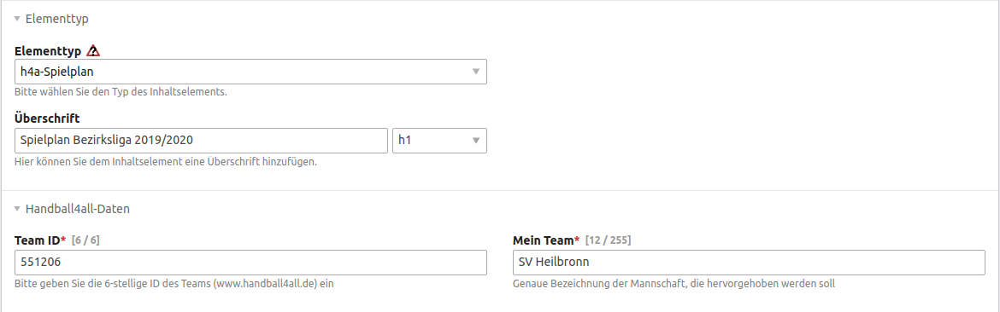
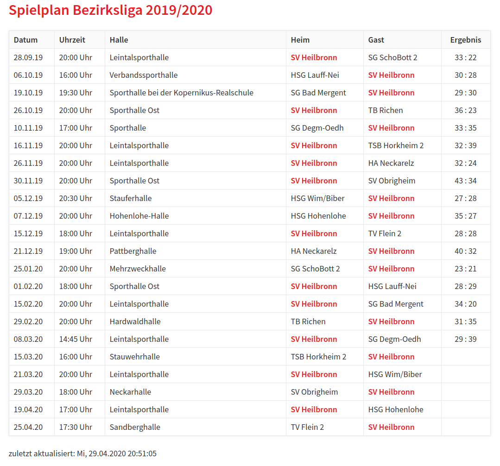
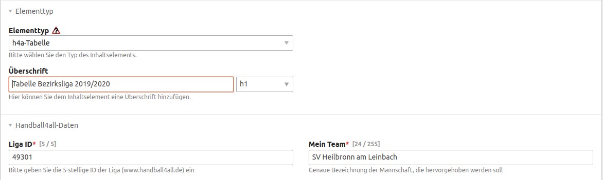
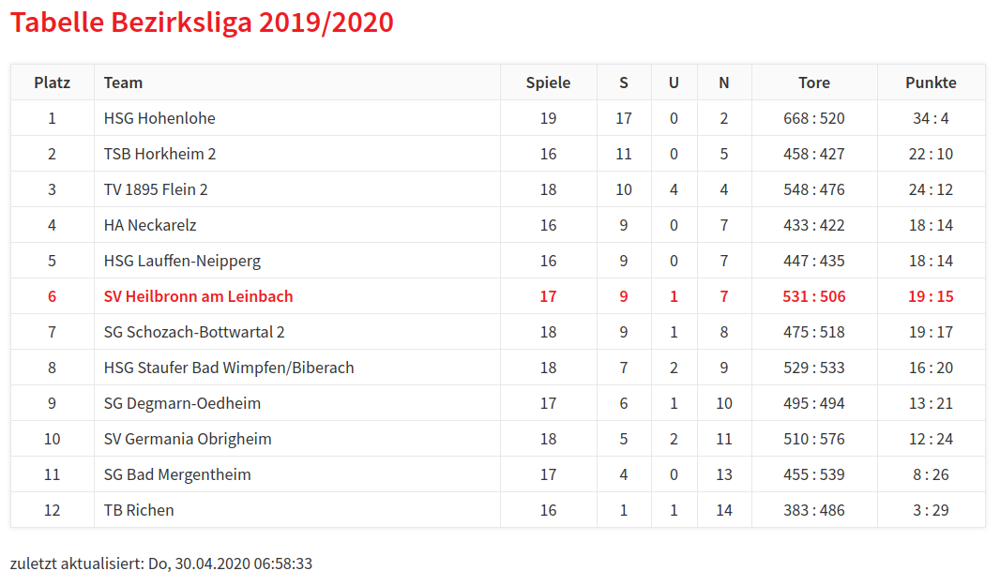
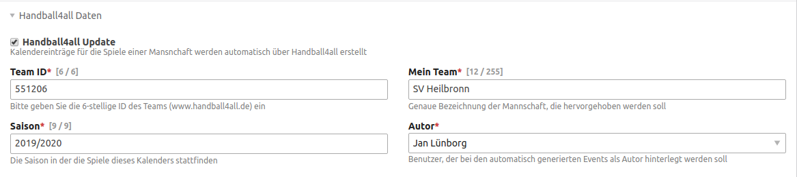
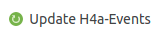

# Spielpläne und Tabellen von handball4all in Contao CMS integrieren

## Features
- Contentelemente zur Anzeige der Spiele eines Teams oder einer Liga 
- Contentelement zur Anzeige der aktuellen Tabelle einer Liga
- Import der Spiele einer Mannschaft in einen Contao-Kalender 
- tägliches Update der Spiele in einem Contao-Kalender 
- stündliches Update der Ergebnisse der Spiele im Contao-Kalender

(IDs der Ligen und Mannschaften kann der Verein in seinem Vereinsaccount abrufen)

# Funktionen
## Elemente
Es stehen die folgenden Content-Elemente zur Verfügung.

### Spielplan Team
Bei diesem Elementtyp stehen folgende Eingabefelder zur Verfügung:
1. Überschrift
2. Team ID: eine 6-stellige ID der Mannschaft, die der Übersicht im Vereinsaccount von handball4all entnommen werden kann
3. Mein Team: Hier muss manuell die genaue Bezeichnung der Mannschaft eingegeben werden. Im Frontend kann dann über die CSS Klasse "myteam" eine Hervorhebung der Mannschaft erfolgen

Hier ein Beispiel:

### Tabelle Liga
Bei diesem Elementtyp stehen folgende Eingabefelder zur Verfügung:
1. Überschrift
2. Liga ID: eine 5-stellige ID der anzuzeigenden Liga, die der Übersicht im Vereinsaccount von handball4all entnommen werden kann
3. Mein Team: Hier muss manuell die genaue Bezeichnung der Mannschaft eingegeben werden. Im Frontend kann dann über die CSS Klasse "myteam" eine Hervorhebung der Mannschaft erfolgen.

Hier ein Beispiel:

### Spielplan Liga
Bei diesem Elementtyp stehen folgende Eingabefelder zur Verfügung:
1. Überschrift
2. Liga ID: eine 5-stellige ID der anzuzeigenden Liga, die der Übersicht im Vereinsaccount von handball4all entnommen werden kann
3. Mein Team: Hier muss manuell die genaue Bezeichnung der Mannschaft eingegeben werden. Im Frontend kann dann über die CSS Klasse "myteam" eine Hervorhebung der Mannschaft erfolgen

### Aktuelle Spiele Verein
Bei diesem Elementtyp stehen folgende Eingabefelder zur Verfügung:
1. Überschrift
2. Verein ID: eine ID des anzuzeigenden Vereins, die der Übersicht im Vereinsaccount von handball4all entnommen werden kann
3. Mein Team: Hier muss manuell die genaue Bezeichnung der Mannschaft eingegeben werden. Im Frontend kann dann über die CSS Klasse "myteam" eine Hervorhebung der Mannschaft erfolgen.

## Kalender
### Anlegen eines neuen Kalenders für einen Mannschaft
Es besteh die Möglichkeit für die Spiele einer Mannschaft einen eigenen Contao Kalender anzulegen, um dann die Contao Standard-Module zur Ansicht der Spiele zu nutzen.
 Dazu muss man beim Anlegen eines neuen Kalenders lediglich das Häkchen "Handball4all Update" aktivieren und die entsprechenden Felder füllen.

Dann am Besten mit "Speichern und Bearbeiten" schließen und in der Ansicht "Bearbeiten" des Kalenders auf "Update H4a Events" klicken.

Über einen CronJob werden dann für jeden Kalender, bei dem das Häkchen "Handball4all Update" gesetzt ist, einmal am Tag die Spiele aktualisiert, falls sich Termine ändern sollten

Außerdem wird über einen CronJob stündlich geprüft, ob für die Spiele neue Ergebnisse vorliegen und diese ebenfalls aktuaisiert.

# Handball4all: 
## Nur Handballvereine folgender Verbände bzw. Oberligen dürfen die Daten verwenden
- Badischer HV
- Hamburger HV
- HV Rheinhessen
- HV Saar
- HV Schleswig-Holstein
- Pfälzer HV
- Südbadischer HV
- HV Westfalen
- HV Württemberg
- Oberliga Rheinland-Pfalz/Saar
- Fédération Luxembourgeoise de Handball
- Vorarlberger HV

Jede weitere Verwendung der Schnittstellen bzw. der abgerufenen Daten ist nicht erlaubt. Dies gilt insbesondere für die Darstellung auf Webseiten die:

- nicht vereinsbezogen sind,
- mehrere Ligen und/oder mehrere Vereine darstellen, sofern keine Spielgemeinschaft besteht und/ oder
- als Portalseiten ein möglichst weitreichendes Abbild unserer Daten verfolgen.
